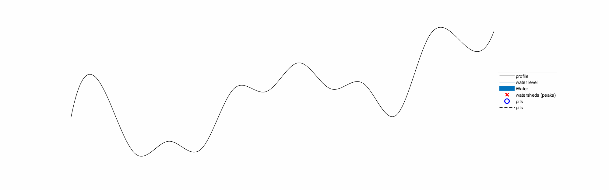
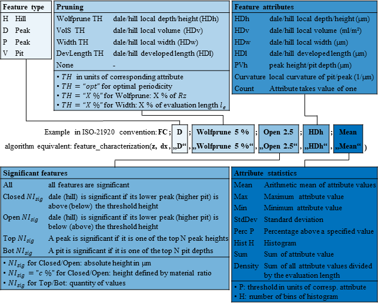

# Feature Characterization
## Information
The algoritm is based on the definitions in ISO 21920-2.
With appropriate permissions, the iso can be viewed here: https://nautos.de/3PI/search/item-detail/DE30091970

A documentation of the algorihtm can be found here: https://www.overleaf.com/4687699647jtrjxjypwqmz#0ccd85

## Watershed Segmentation
In the following are some illustrations to show idea of watershed segemenation. For more information see documentation.

### Method to determine watersheds in 2.5D data set
<div align="center">

  <!-- <video src="figures/animation.mp4" width="400" /> -->
</div>

### Method transferred to 2D data set
<div align="center">

</div>

## Usage of feature characterization
For now see minimal_example.m
The Convention is summarized in the following figure:
<div align="center">

</div>

## Preliminaries Matlab
Add "FC_Functions"-folder to search path of Matlab
```
addpath(*path to FC_Functions*)
```
to permanently save the path
```
save path
```
##### Requirements
- MATLAB 2017a and higher

## Preliminaries python

##### Requirements
python 3.x