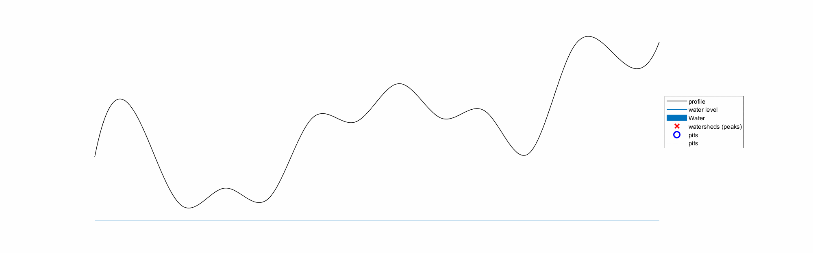
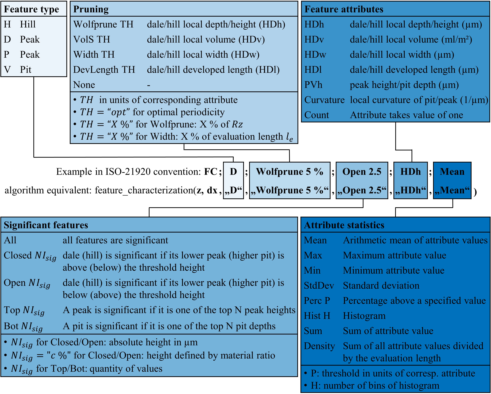
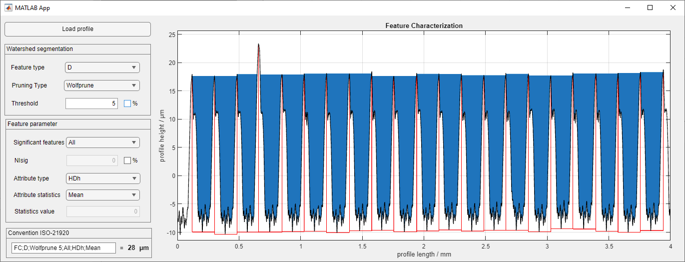

[](https://doi.org/10.5281/zenodo.14676921)

# Feature Characterization
This repository contains the companion code for the paper ["Feature Characterization for Profile Surface Texture"](https://iopscience.iop.org/article/10.1088/2051-672X/adaa07).
The algorithm is based on the definitions in [ISO 21920-2](https://www.iso.org/standard/72226.html).


## Watershed Segmentation
In the following are some illustrations to show the idea of watershed segmentation. For more information, see the paper.

<!-- ### Method to determine watersheds in 2.5D data set
<div align="center">
<video controls src="data/figures for readme/animation.mp4"></video>
</div> -->

### Method to determine watersheds in 2.5D data set
https://github.com/mts-public/feature-characterization-for-profile-surface-texture/assets/160241233/c9c3f5b2-3d39-4655-8e8a-f84d95a2a652

### Method transferred to 2D data set
<div align="center">

</div>

## Usage of feature characterization
The Convention is summarized in the following figure:
<div align="center">

</div>
The functionality can be tested directly using "minimal_example.m" with or "minimal_example.py" an editable dummy profile. Alternatively, there is a GUI for Matlab "GUI.mlapp" where, for example, the profiles from "data/profiles for case studies" can be loaded and the algorithm applied by varying the various input arguments.
<div align="center">

</div>

## Preliminaries MATLAB
Add "featurecharacterization2d"-folder to search path of Matlab
```
addpath(*path to featurecharacterization2d*)
```
to permanently save the path
```
save path
```
##### Version
- MATLAB 2017a and higher

## Preliminaries Python

Install `featurecharacterization2d` package.

```bash
cd python
pip install .
```

Additional dependencies for development and plotting (`scipy`, `matplotlib`, `jupyter notebook`) are installed by
```bash
pip install .[extra]
```

##### Version
- python>=3.11
