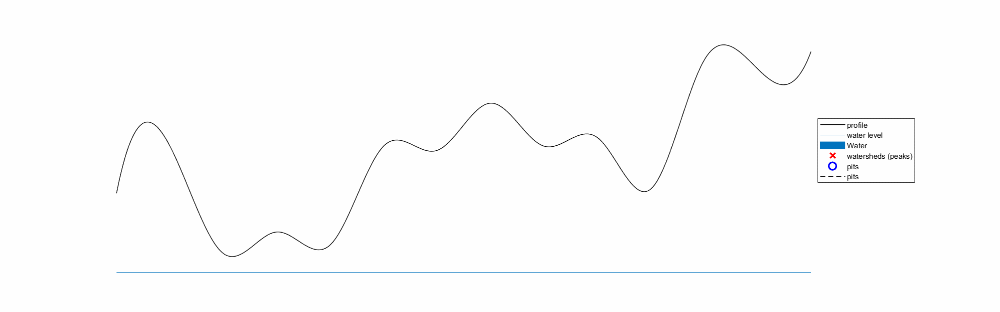
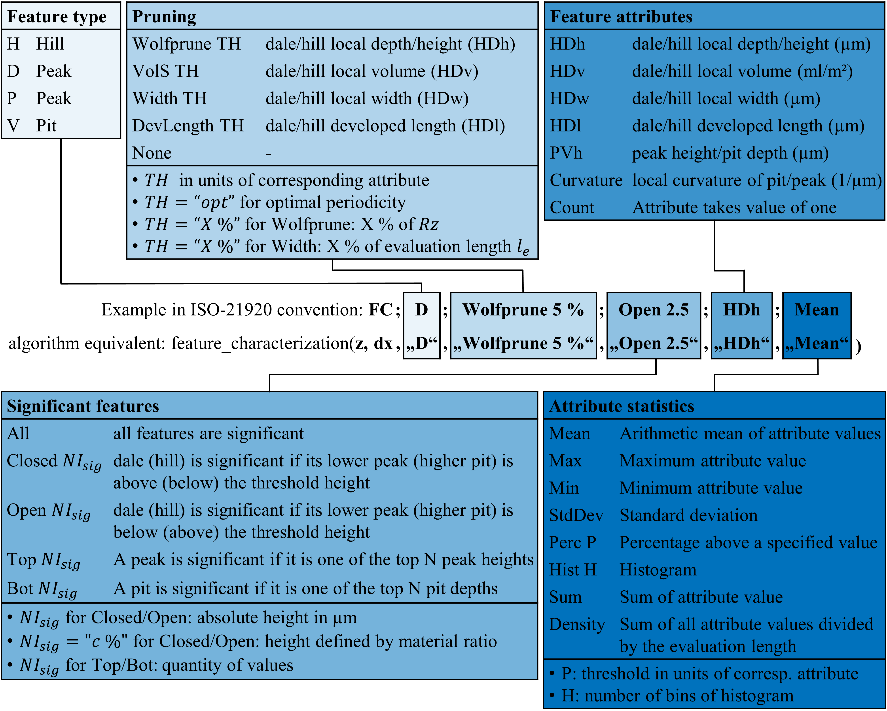
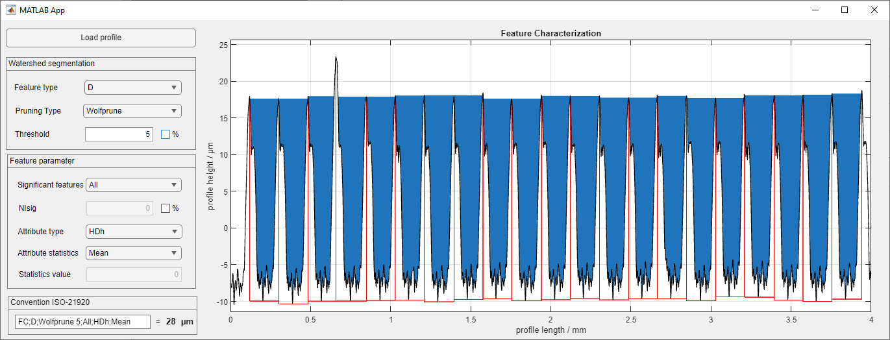

[](https://doi.org/10.5281/zenodo.14676921)

# Feature Characterization
This repository contains the companion code for the paper ["Feature Characterization for Profile Surface Texture"](https://iopscience.iop.org/article/10.1088/2051-672X/adaa07).
The algorithm is based on the definitions in [ISO 21920-2](https://www.iso.org/standard/72226.html).


## Watershed Segmentation
In the following are some illustrations to show the idea of watershed segmentation. For more information, see the paper.

<!-- ### Method to determine watersheds in 2.5D data set
<div align="center">
<video controls src="data/figures for readme/animation.mp4"></video>
</div> -->

### Method to determine watersheds in 2.5D data set
https://github.com/mts-public/feature-characterization-for-profile-surface-texture/assets/160241233/c9c3f5b2-3d39-4655-8e8a-f84d95a2a652

### Method transferred to 2D data set
<div align="center">

</div>

## Usage of feature characterization
The Convention is summarized in the following figure:
<div align="center">

</div>
The functionality can be tested directly using "minimal_example.m" with or "minimal_example.py" an editable dummy profile. Alternatively, there is a GUI for Matlab "GUI.mlapp" where, for example, the profiles from "data/profiles" can be loaded and the algorithm applied by varying the various input arguments.
<div align="center">

</div>

### Softgauge files and default parameters
Profiles in the softgauge format of ISO 5436-2 (`*.smd`) are read with `smd2mat` (MATLAB, folder "softgauge") or `read_smd` (Python). Both return the profile values in µm and the step size `dx` in mm as given in the file. Use this `dx` instead of an assumed nominal value. The named feature parameters of ISO 21920-2 (Rpd, Rvd, Rmpc, Rmvc, R5p, R5v, R10z) with the default settings according to ISO 21920-3 are calculated by `default_FC_parameters` (MATLAB) or `default_fc_parameters` (Python):
```python
from featurecharacterization2d import read_smd, default_fc_parameters

z, L, x, dx = read_smd("data/profiles/Bu_1_56_ak.smd")
xFC = default_fc_parameters(z - z.mean(), dx)
```

## Preliminaries MATLAB
Add "featurecharacterization2d"-folder to search path of Matlab
```
addpath(*path to featurecharacterization2d*)
```
to permanently save the path
```
save path
```
##### Version
- MATLAB 2017a and higher

## Preliminaries Python

Install `featurecharacterization2d` package from PyPI
```bash
pip install featurecharacterization2d
```
or from this repository
```bash
cd python
pip install .
```

`numpy`, `scipy` and `matplotlib` are installed automatically. The additional dependency for the case studies (`jupyter notebook`) is installed by
```bash
pip install .[extra]
```

##### Version
- python>=3.10
